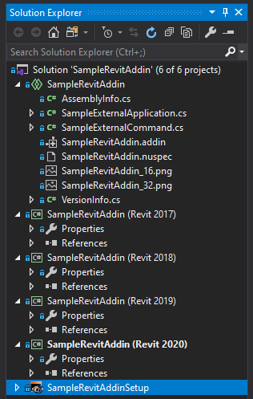

# Sample Revit Add-In

This repository is a sample add-in for Autodesk Revit which utilizes shared projects to target multiple versions of the Revit API simultaneously.




## Shared Project

[SampleRevitAddin.shproj](SampleRevitAddin/SampleRevitAddin.shproj)

The cornerstone of this system is the shared project which contains all of the functionality and code targeting the Revit API. The goal here is to avoid duplicating any code, while still building add-in assemblies that target distinct versions of the Revit API. 

### [AssemblyInfo.cs](SampleRevitAddin/AssemblyInfo.cs)

This file sets assembly attributes that are shared across all releases of the add-in

```
[assembly: AssemblyTitle("SampleRevitAddin")]
[assembly: AssemblyDescription("Description")]
[assembly: AssemblyConfiguration("")]
[assembly: AssemblyCompany("Author")]
[assembly: AssemblyProduct("SampleRevitAddin")]
[assembly: AssemblyCopyright("Copyright ©  2020")]
[assembly: AssemblyTrademark("")]
[assembly: AssemblyCulture("")]
```

### [VersionInfo.cs](SampleRevitAddin/VersionInfo.cs)

This file defines a simple static `Version` property that is used to update the `AssemblyVersion` attributes of all the releases from a single place.

```
public class VersionInfo
{
	public const string Version = "0.1";
}
```


### Add-In Manifest and Other Common Files

The Revit API add-in manifest file should be included in the shared project with the "Copy to Output Directory" option should be set to "Copy Always"

The `<Assembly` references in the file should be relative to the target build folder. For example: 

```xml
</RevitAddIns>
  <AddIn Type="Application">
    <Name>Sample External Application</Name>
    <Assembly>SampleRevitAddin.dll</Assembly>
    <FullClassName>SampleRevitAddin.SampleExternalApplication</FullClassName>
    <ClientId>e6a80a65-4b5b-414a-aa37-badf750c00c2</ClientId>
    <VendorId>ABC</VendorId>
    <VendorDescription>ACME</VendorDescription>
  </AddIn>
</RevitAddIns>
```

Other files, such as icons, can also be included in the shared projects and set to "Copy Always". 


## Release Projects

The actual add-in assembly files are built in many "real" C# projects that each target a specific release of Revit. 

### References

Each release project will reference the shared project  explained above, as well as a specific version of the Revit API dlls.

Note: Make sure `Copy Local` is set to false for the Revit API

### Target Framework

The target framework of each release project needs to match that of the target Revit API. Refer to the table below.

| Revit API  | .NET Framework |
| ---------- | -------------- |
| 2015, 2016 | 4.5            |
| 2017, 2018 | 4.6            |
| 2019, 2020 | 4.7            |
| 2021       | 4.8            |


### Compilation Symbols

Each release project should have a `REVIT20xx` style conditional complication symbol added to "All Configurations" on the "Build" tab of the project properties. 

See the section below on how this can be used with preprocessor directives to control what code is built against each version of the Revit API.

### Post-build Event

The post build event of each release project calls a powershell script `post-build.ps1`. This passes a number of arguments to the script that controls how it is executed.

```
powershell -NoProfile -ExecutionPolicy Unrestricted -File "$(SolutionDir)post-build.ps1" -ConfigurationName "$(ConfigurationName)" -SolutionDir "$(SolutionDir)\" -TargetDir "$(TargetDir)\" -TargetName "$(TargetName)" -AddInFileName SampleRevitAddIn.addin -RevitRelease 2017
```

- **ConfigurationName**: The currently selected build configuration. This is used to identify if a debug add-in manifest file should be created.
- **SolutionDir**: The root solution directory. Usualy `$(SolutionDir)\`
- **TargetDir**: The target directory. Usualy `$(TargetDir)\`
- TargetName: The name of the assembly . Usually `$(TargetName)`
- **AddInFileName**: The name of the add-in manifest file.
- RevitRelease: The release that was targeted. This is hard coded into each release project.


#### post-build.ps1

The post build script performs the following actions

1. Digitally signs the built assembly file [Optional]
2. If the current configuration is "Debug"
    1.  Copy the add-in manifest file to the Revit Addins folder that coresponds to the target release of Revit
    2.  Repath the `<Assembly>` elements in the file to direct to the current target directory.

### Start External Program

The "Start external program" option on the "Debug" tab of the project properties should be set to the path to the `revit.exe` the corresponds to the target release.

`C:\Program Files\Autodesk\Revit 2020\Revit.exe`

### [AssemblyInfo.cs](SampleRevitAddin%20(2017)/Properties/AssemblyInfo.cs)

The `AssemblyInfo.cs` file in the release project set the actual assembly version of the DLL built by each project. This is hardcoded with the release concatenated with the version defined by `VersionInfo`.

```C#
[assembly: AssemblyVersion("2017." + SampleRevitAddin.VersionInfo.Version)]
```

## Cleaning Debug Manifests

The release projects contain an `AfterClean` tasks that deletes the temporary debug add-in manifest file(s). 

```xml
  <Target Name="AfterClean">
    <Delete Files="$(AppData)\Autodesk\REVIT\Addins\2019\Debug - SampleRevitAddIn.addin" />
  </Target>
```

To make use of this run the "Clean Solution" command from the "Build" menu, or right click on a specific project and select "Clean".

## Code Signing

The `post-build.ps1` script can automatically sign the complied assemblies, but this is disabled by default. To enable this feature

1. Ensure that `signtool.exe` is installed on your system and part of the PATH and thus accessible at the command line
2. Open `post-build.ps1` and uncomment the lines that begin with `$certThumb` and `signtool`
3. Set `$certThumb` to the SHA1 hash of the signing certificate installed on your machine that you want to use.

```
#Sign the Assembly
#$certThumb = "0000000000000000000000000000000000000000"
#signtool sign /v /t http://timestamp.digicert.com /sha1 $certThumb
```

## Assembly Versions

Assemblies versions are set to follow a psedo-semvar format of  `rrrr.maj.min` 

- ***rrrr***: The release of the Revit API the add-in targets (e.g 2019, 2020). 
- **maj**: The major version number. This may be 0 for inital development, and increments when major or breaking changes are added. 
- **min**: Minor version number. This starts at 1 and is incremented when no-breaking or minor changes are aded.

The `rrrr` values are hard coded into the `AssemblyInfo.cs` file for each release project. The `maj.min` values are set by `VersionInfo.Version` in the `VersionInfo.cs` file in the shared project. 

##  GIT Tags

When tagging specific versions of an add-in in a GIT repository use the greatest assembly version number.

For example if a solution has projects for Revit 2019, 2020, and 2021 and 
`Versioninfo.Version` is set to  "1.2" then the greatest version will be "2021.1.2".

If new functionality is added `VersionInfo.Version` may be updated to "1.3". Thus the next git tag will be "2021.1.3".

If support for a later version of Revit is added by adding a new project for Revit 2022. This release will be tagged as "2022.1.3".

## Revit Release Preprocessor Directives

A `REVIT20XX` complication symbol is added to each project that identifies the targeted release of Revit. These case be used with [preprocessor directives](https://docs.microsoft.com/en-us/cpp/preprocessor/preprocessor-directives?view=msvc-160) to compile different code in the shared project depending on the version of the Revit API. This is useful when features of the API are renamed or deprecated.

```C#
#if REVIT2017
            Autodesk.Revit.UI.TaskDialog.Show("SampleExternalCommand", "Sample Revit 2017 Add-in");
#elif REVIT2018
            Autodesk.Revit.UI.TaskDialog.Show("SampleExternalCommand", "Sample Revit 2018 Add-in");
#elif REVIT2019
            Autodesk.Revit.UI.TaskDialog.Show("SampleExternalCommand", "Sample Revit 2019 Add-in");
#elif REVIT2020
            Autodesk.Revit.UI.TaskDialog.Show("SampleExternalCommand", "Sample Revit 2020 Add-in");
#endif
```

## Adding Support For New Revit Releases

1. Create a copy of the latest release project folder.
`\SampleRevitAddin (2021)` --> `\SampleRevitAddin (2021) copy`
2. Rename the folder and csproj file it contains to match the new release
3. Update the project to target the new versions of the Revit API
4. If applicable, update the project to target the .NET Framework version required by the new Revit api. (See the table above)
3. Update the release specified in the `AssemblyVersion` attributte in `AssemblyInfo.cs`
4. Update the complication symbol to match the new release
5. Update the `-RevitRelease` argument in the post build event
8. Update the ``AfterClean` task in the csproj file
 
## Migrating Existing Projects

The following outlines the steps to migrate an existing project built against a single release of Revit to this system using a shared project.

1. Rename Existing Project

    1. Rename existing project to "ProjectName (Revit 20xx)" to match existing target release
    2. Move project into a corresponding sub folder name "ProjectName (Revit 20xx)" where 20xx is the release of the Revit API the current project targets. Note: it is often easier to just completely remove the project from the solution, rename the folder and file, and add it back to the solution.

2. Create Shared Project

     1. Create "ProjectName" shared project
     2. Add a reference to to shared project to real project
     3. Move All files except `properties\Assembly.info`  from real project into shared project
     4. Make sure `powershell.exe` and `signtool.exe` are accessible in `PATH`
          you should be able to run either by name directly from a command line

3. Post build Script
     1. Add `post-build.ps1` script to root directory

     2. Add the following post build event to real project that runs `post-build.ps1`
       
         ```
         powershell -NoProfile -ExecutionPolicy Unrestricted -File "$(SolutionDir)post-build.ps1" -ConfigurationName "$(ConfigurationName)" -SolutionDir "$(SolutionDir)\" -TargetDir "$(TargetDir)\" -TargetName "$(TargetName)" -AddInFileName SampleRevitAddIn.addin -RevitRelease 2020
         ```
         
     3. Make sure to set the `-RevitRelease` and `-AddInFileName` properties are set correctly above.

4. Add `REVIT20XX` compilations symbols to "All Configurations" of the project

5. Setup Code Signing [Optional]
     1. Delete existing `signtool.exe` if currently included in source
     2. Make sure ``signtool.exe` are accessible in `PATH`
     3. Uncomment code signing section of`post-build.ps1`
     4. Set the value of `$certThumb`
     
6. Add support for additional releases of Revit by adding new release projects following the instructions above.
